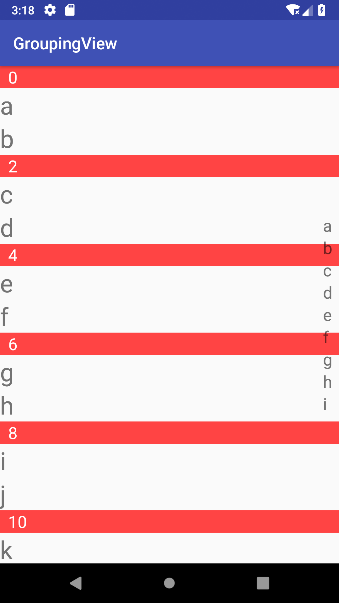

# GroupingViewSample
制作类似联系人页面所需要的Slider，和用来给recyclerview进行分组的ItemDecoration
## 最基本的效果图，效果图比较low


## 1. SliderView
简介：这是一个列表view，继承自Linearlayout，可实现水平或垂直布局，主要作用是当手指划过或点击某个里面的item的时候会有相应的回调
```kotlin
interface ItemListener {
        //只要是摸到了或者划过了这个某个item就会触发，返回对应的item和对应的数据
        fun onTouch(item: View, data: Any?){}
        
        fun onUp(item: View, data: Any?){}

        fun onClick(item: View, data: Any?){}

        fun onLongClick(item: View, data: Any?){}

    }
```
导入：
Step 1. Add the JitPack repository to your build file

Add it in your root build.gradle at the end of repositories:

```groovy
	allprojects {
		repositories {
			...
			maven { url 'https://jitpack.io' }
		}
	}
```
Step 2. Add the dependency
```groovy
	dependencies {
	        implementation 'com.github.nelson1110:GroupingViewSample:v1.0.0'
	}
```


用法：

* 首先在xml中添加SliderView
```xml
<com.libs.nelson.groupingview.SliderView
        android:background="@color/colorPrimary"
        android:id="@+id/slider"
        android:layout_width="wrap_content"
        android:layout_height="wrap_content"
        android:orientation="vertical"
        />
``` 
* 然后在代码中给Slider绑定对应的Adapter
```kotlin
slider.setAdapter(object : SliderView.SliderAdapter(){

            override fun getItemDataList(): List<Any> {
               return listOf("a","b","c","d","e","f","g","h","i")
            }

            override fun onBindItem(item: View, data: Any) {
                item.findViewById<TextView>(R.id.item).text = data.toString()
            }

        })
```
如果没有特殊需求，默认会提供一个item的布局，大概长这样
```xml
<TextView xmlns:android="http://schemas.android.com/apk/res/android"
    android:id="@+id/item"
    android:layout_width="wrap_content"
    android:layout_height="wrap_content"
    android:text="test"
    android:textSize="20sp">
</TextView>
```
如果不喜欢也可以自定义，只需要重写Adapter中的`getItemLayout(): Int{}`方法，例如：
```kotlin
override fun getItemLayout(): Int{
            return R.layout.item_slider_default
        }
```
* 最后就是设置监听事件，需要监听啥就重写啥就好了
```kotlin
slider.setItemListener(object : SliderView.ItemListener{

            override fun onTouch(item: View, data: Any?) {
                Toast.makeText(this@MainActivity,data.toString(),Toast.LENGTH_SHORT).show()
            }

        })
```
## 2. GroupDecoration
简介：可以自己控制列表的分组规则和分组标题的样式，而且可以用xml绘制分组标题
用法：
* 像所有其他的ItemDecoration一样，add到recyclerview上就可以了，主要需要实现下面几个方法
```kotlin
    //判断当前position的数据是否是一个组的第一个，也就是需要加分组item的position
    abstract fun checkItemIsFirstOfGroup(position: Int): Boolean
    //返回分组标题的布局，例如：return R.layout.xxx
    abstract fun getGroupViewLayout(position: Int): Int
    //给分组标题绑定数据，groupView为这个需要绘制的view，position是当前组第一个item的位置
    abstract fun onBindGroupView(groupView: View,position: Int)
```
